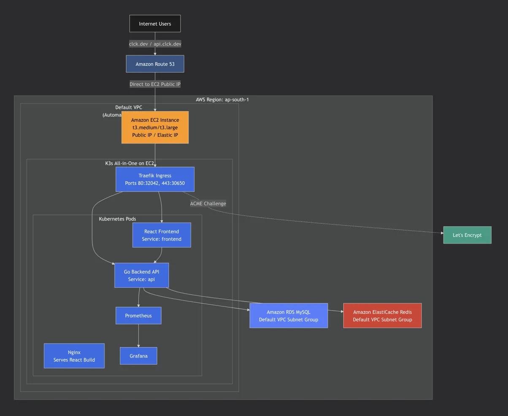
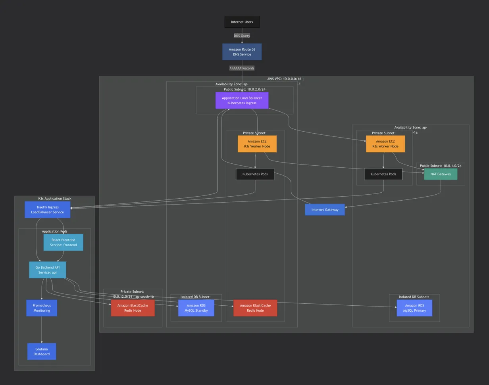

# Architecture Documentation

## What This System Does

This is a URL shortener service - basically you give it a long URL and it gives you back a short one that redirects to the original. Pretty straightforward.

The main things it needs to do:

-  Take long URLs and create unique short codes
-  Store these mappings somewhere reliable
-  Redirect users when they click the short link
-  Handle lots of redirect requests (way more reads than writes)
-  Stay up even if something breaks

## System Architecture

### Current Implementation



This is what's actually running right now on AWS.

**What you're looking at:**

-  Everything runs in the **default VPC** (no custom networking setup)
-  Single EC2 instance running K3s all-in-one (control plane + worker on same box)
-  Traefik Ingress handles routing and SSL termination
-  RDS MySQL and ElastiCache Redis are in default subnet groups
-  Let's Encrypt provides free SSL certificates via ACME challenge
-  Prometheus and Grafana run as pods for monitoring
-  Nginx serves the React build as static files

**Key characteristics:**

-  Everything in public subnets with security group restrictions
-  No private subnets, no NAT Gateway, no fancy networking
-  All components can talk to each other through security groups
-  Total monthly cost: ~$220-225

**Why this works for now:**

-  I have basically zero traffic, so high availability isn't critical
-  Security groups provide enough isolation for a learning project
-  Way cheaper than doing it "the right way"
-  I can manage everything myself and learn how it all fits together

---

### Future Architecture (When I Have Budget)



This is what I'd build if I had ~$400-500/month to spend. Shows proper production setup.

**Major differences from current:**

-  **Custom VPC** with public and private subnets across multiple availability zones
-  **NAT Gateway** so stuff in private subnets can reach the internet securely
-  **Application Load Balancer** instead of Traefik for better AWS integration
-  **EKS** instead of self-managed K3s (managed control plane)
-  **Multi-AZ RDS** with read replicas for high availability
-  **Redis Cluster** with automatic failover
-  **Auto Scaling Groups** for worker nodes that can self-heal
-  **Proper network isolation** - databases can't be reached from internet at all

**Why not doing this now:**

-  NAT Gateway alone: ~$35/month
-  EKS control plane: ~$75/month
-  Additional worker nodes: ~$60-120/month
-  Multi-AZ RDS: +$15-20/month
-  Would push total to $400-500/month

I've designed this architecture to show I understand production patterns, even though I'm running a simplified version due to budget. The current setup gets me 80% of the learning for 50% of the cost.

---

### Current Setup Details

I'm running this on AWS using a K3s cluster on EC2 instances. The setup is pretty simple:

**Traffic Flow:**

-  Users hit clck.dev
-  Route53 handles DNS and points to my cluster
-  Traefik (running in the cluster) handles the SSL stuff and routes traffic
-  Frontend (React) serves the UI at clck.dev
-  Backend (Go API) handles the actual shortening/redirect logic at api.clck.dev
-  Redis caches popular URLs so I don't hammer the database
-  MySQL stores everything permanently

**Monitoring:**

-  Prometheus collects metrics from the app
-  Grafana shows me what's happening in dashboards
-  Both running in the cluster

**Current Setup:**

-  2 EC2 instances for K3s (c7i-flex.large) - one control plane, one worker
-  1 EC2 instance for Jenkins CI/CD (m7i-flex.large)
-  MySQL RDS db.t3.micro with 20GB storage
-  Redis ElastiCache cache.t3.micro
-  Using the default VPC (I know, not ideal)
-  Monthly cost: ~$220-225

## Why I Built It This Way

### Go for the Backend

I picked Go mainly because I wanted to learn it. It's used a lot in DevOps tools (Kubernetes, Docker, etc.) and I'm hoping to contribute to that ecosystem eventually. Also it's supposed to be good for this kind of high-traffic stuff.

### React for Frontend

Just went with React because I already know it and can move fast. Nothing fancy here - the UI is pretty simple anyway (just a form to submit URLs). Could've done plain HTML but React makes it easier to add features later if I want.

### K3s Instead of EKS

This was a budget thing. Let me break down the math:

**Current setup (K3s):** ~$220/month

-  2x c7i-flex.large for K3s: ~$120
-  1x m7i-flex.large for Jenkins: ~$60
-  RDS: ~$17
-  ElastiCache: ~$13
-  Data transfer and misc: ~$10

**If I used EKS:** ~$295/month

-  EKS control plane: $75/month just for that
-  Plus same instance costs

So I'm saving about $75/month by managing K3s myself. As a student, that's significant. The downside is I have to handle upgrades and maintenance manually, but honestly that's good learning experience. I'm getting hands-on with Kubernetes without the abstraction layer.

In a real company with a team? Yeah, definitely use EKS. The operational overhead isn't worth the savings.

### MySQL Instead of NoSQL

I went with MySQL because... I know SQL. That's pretty much it. I thought about DynamoDB but the pricing is confusing and I didn't want to deal with learning DynamoDB query patterns while also learning Go and K3s.

Also, for a URL shortener, the data model is super simple - just storing mappings. MySQL works fine and gives me ACID guarantees which is nice for preventing duplicate short codes.

Cost-wise it's about the same at this scale (~$15-17/month for db.t3.micro).

### Single Redis Instance

Two reasons: budget and traffic.

Redis clustering would cost me ~$25/month instead of ~$12/month. Right now I have basically zero traffic (it's a learning project), so high availability for the cache seems like overkill.

If Redis goes down, requests just hit MySQL directly. It's slower but not broken. The cache is just for performance, not correctness.

When I actually have traffic that justifies it, I'll add clustering.

### Traefik Instead of AWS ALB

Traefik is free (runs in my cluster) while ALB costs ~$20-25/month minimum. Since I'm already running K3s, Traefik integrates nicely and handles the Let's Encrypt cert stuff automatically.

The downside is Traefik isn't as battle-tested as ALB for huge production loads, but for my traffic (again, basically zero) it works great.

### Self-Hosted Prometheus and Grafana

This was 100% a learning decision. I wanted to understand how observability works without just clicking around CloudWatch. These are industry-standard tools and the skills transfer anywhere.

Also saves money since I'm not paying for CloudWatch custom metrics, but mainly it's about learning.

### Let's Encrypt for SSL

Free certificates. That's it. I could use AWS Certificate Manager but that requires either ALB or CloudFront which both cost money. Let's Encrypt + cert-manager in K3s handles everything automatically.

### Using Default VPC

I know I should create a custom VPC with public/private subnets, put the databases in private subnets, use a NAT gateway, etc. But:

1. NAT gateway costs ~$35/month
2. Adds complexity to setup
3. For a project with no sensitive data and no real users, it's overkill

If this was handling real user data or company stuff, I'd definitely do proper network isolation. For now, security groups are good enough.

## How Requests Work

### Creating a Short URL (POST /shorten)

1. User sends POST request with a long URL to api.clck.dev
2. Route53 → Traefik → Go API pod
3. API checks if the URL is valid
4. Checks rate limits using Redis (so people can't spam)
5. Generates a unique short code
6. Saves it to MySQL (this is the source of truth)
7. Also caches it in Redis for fast lookups
8. Returns the short URL to the user

### Redirecting (GET /{short_code})

This is the hot path - happens way more than creating URLs.

1. User clicks short link (clck.dev/abc123)
2. Route53 → Traefik → Go API pod
3. API checks Redis first
   -  **If found in cache:** Redirect immediately (~5-10ms)
   -  **If not in cache:** Query MySQL, cache it, then redirect (~50-100ms)
4. If the code doesn't exist at all, return 404

Most requests (~85-90% if the cache is working) hit Redis and never touch the database.

### Frontend Access

1. User goes to clck.dev
2. Route53 → Traefik → React pods
3. Browser loads the UI
4. When user submits a URL, frontend calls api.clck.dev

Pretty standard stuff.

## Database Schema

Using MySQL RDS. Super simple schema:

**url_table:**

```
id           INT (primary key, auto-increment)
short_code   VARCHAR(30) (unique index)
actual_url   VARCHAR(500)
created_at   TIMESTAMP
expires_at   TIMESTAMP
```

The unique index on `short_code` is important - that's what makes lookups fast. Most queries are like `SELECT actual_url FROM url_table WHERE short_code = 'abc123'` and the index makes this instant.

**Write pattern:** Only happens when creating new short URLs. Low volume.

**Read pattern:** Every redirect hits this (or the cache). High volume, read-heavy.

### Caching Strategy

Redis caches the `short_code → actual_url` mapping.

-  Key format: `url:abc123` → `https://example.com/long/url`
-  TTL matches the expiration time from the database
-  MySQL is always the source of truth
-  If Redis dies, everything still works (just slower)

**Write flow:** MySQL first, then Redis
**Read flow:** Redis first, MySQL on miss

It's eventual consistency but that's fine for this use case.

## Scaling Strategy

Right now I'm way over-provisioned for my actual traffic (which is near zero). But here's how things scale:

### Application Scaling

The Go API is stateless - no sessions, no local state. So I can just add more pods when needed. Currently running 2 pods for basic redundancy.

Traefik load balances between them.

Frontend also runs 2 pods and scales independently.

### Cache Scaling

Redis handles most of the read traffic. The more cache hits, the less database load.

Right now single instance is fine. Later I can:

-  Upgrade to bigger instance
-  Add clustering for HA
-  Add read replicas

### Database Scaling

MySQL is the bottleneck for writes, but writes are rare (only when creating URLs).

For reads, the cache handles most of it.

If needed later:

-  Upgrade to bigger RDS instance
-  Add read replicas
-  Multi-AZ for HA

### Infrastructure Scaling

Current limitation: Only 1 worker node. If it dies, pods go down.

I'm doing everything manually - no auto-scaling at the node level.

Why? Budget. More nodes = more money.

**Real bottleneck right now:** Not traffic - it's the single worker node. If I actually get traffic, I'll add more worker nodes.

## What I'd Do With More Budget

If I had ~$400-500/month to spend, here's what I'd change (in order):

### 1. Switch to EKS (~$75 extra/month)

Get rid of K3s, use managed Kubernetes. Benefits:

-  No manual control plane management
-  Better AWS integration
-  Automatic HA across availability zones
-  Managed node groups with auto-scaling

Right now I'm saving $75/month by doing it myself, but in production that operational time isn't worth it.

### 2. Add Auto-Scaling and HA (~$100-150/month)

Current problem: Single worker node is a single point of failure.

What I'd do:

-  Put worker nodes in an Auto Scaling Group
-  Run 2-3 nodes across different availability zones
-  Automatic node replacement if one fails
-  Actually reliable uptime

### 3. Better Database and Cache (~$50-75/month)

-  Redis: Add clustering with replicas (automatic failover)
-  MySQL: Multi-AZ deployment + read replica
-  Better backup retention

Right now if MySQL goes down I'm screwed. With Multi-AZ it fails over automatically.

### 4. Proper VPC Setup (~$35-40/month)

Create custom VPC with:

-  Public subnets for load balancers
-  Private subnets for apps and databases
-  NAT Gateway for private subnet internet access
-  Security groups that actually isolate things properly

This is what you'd do in a real company. Defense in depth.

### 5. Add CloudFront CDN (~$15-25/month)

Put CloudFront in front for:

-  Global edge caching
-  Lower latency for users far from us-east-1
-  DDoS protection
-  SSL termination at edge

Only makes sense if I had global traffic though.

## Current Limitations

Let me be honest about what's not great:

1. **Single worker node** - If it dies, everything goes down until I manually fix it
2. **Single Redis** - If cache dies, everything hits the database (slow but works)
3. **Single-AZ database** - If RDS has issues, I'm down
4. **No automated disaster recovery** - Everything is manual
5. **Default VPC** - Not as secure as proper network isolation
6. **Manual scaling** - I have to ssh in and change things

For a learning project with zero traffic? These are fine. For production? Would need to fix all of these.

## Why This Architecture Makes Sense

**For my situation:**

-  I'm learning K3s, Go, and cloud infrastructure hands-on
-  Keeping costs under ~$225/month as a student
-  Building something that actually works and could scale if needed
-  Getting experience with real tools (Kubernetes, Prometheus, Redis, etc.)

**The trade-offs:**

-  More operational work (manual everything)
-  Less reliable than managed services
-  Single points of failure
-  But: way cheaper and way more learning

**What I'm demonstrating:**

-  I understand production patterns even if I can't afford to implement them all
-  I made practical decisions based on constraints
-  I know what I'd do differently with more resources
-  I can build something that works and explain why it's built that way

## Summary

This is a learning project that happens to be way over-engineered for the traffic it gets (basically zero). But that's the point - I wanted to build something that could theoretically handle real traffic while learning modern cloud infrastructure.

The architecture is:

-  Simple enough to manage solo
-  Cheap enough to run as a student (~$220/month)
-  Realistic enough to learn production patterns
-  Scalable enough to grow if needed

Could I have built this cheaper? Yeah, throw it on a single VPS for $5/month.

Could I have built it better? Yeah, with $1000/month I could make it bulletproof.

But for learning cloud-native architecture on a student budget? I think this hits the sweet spot.
