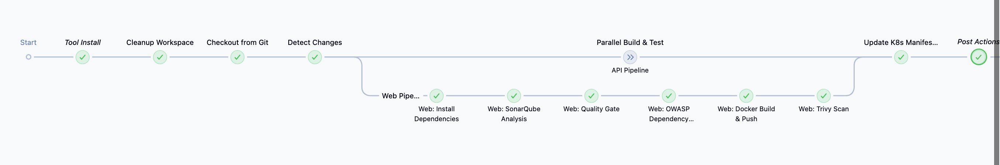
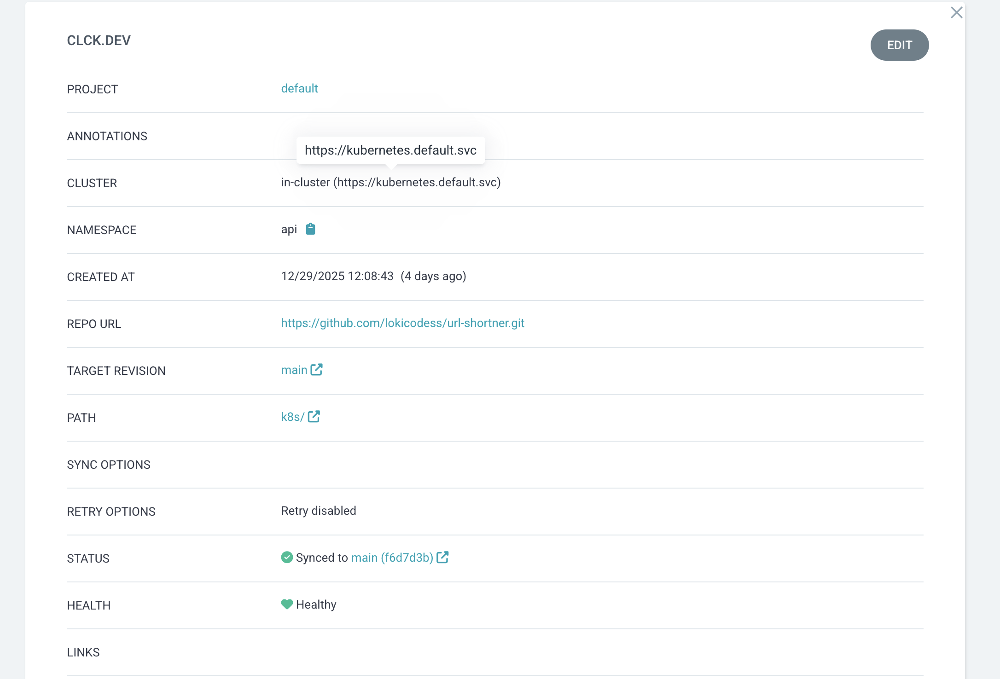
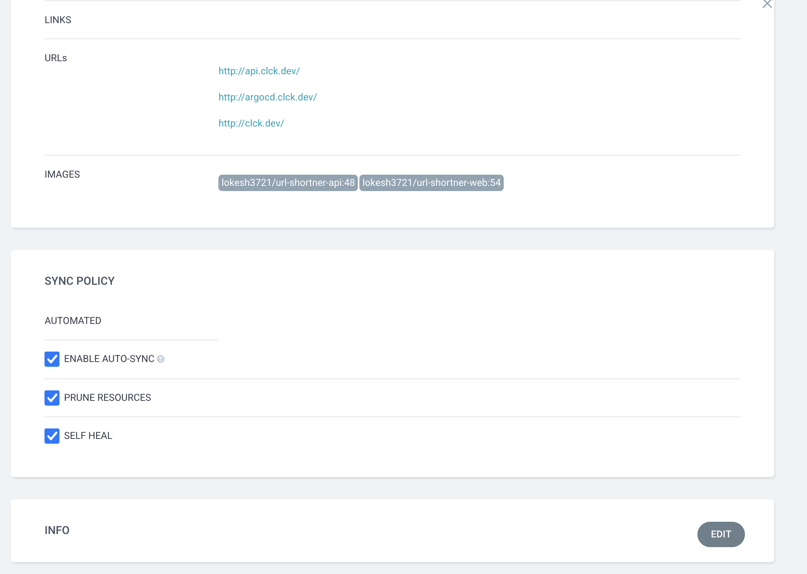
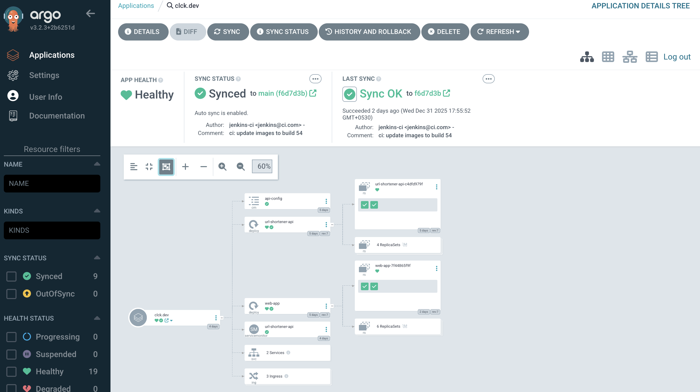

# Deployment Documentation

This doc explains how code gets from my laptop to production. It's probably more complex than it needs to be for a project with zero users, but that's the point - learning how real deployments work.

## How It Works (High Level)

1. Push code to GitHub
2. Jenkins picks it up and runs tests/builds
3. Docker images get built and pushed to Docker Hub
4. Jenkins updates the Kubernetes manifests with new image tags
5. ArgoCD notices the change and syncs to K3s
6. Prometheus/Grafana track everything

From commit to live: about 5-7 minutes total.

---

## Jenkins CI/CD Pipeline

### How It Triggers

GitHub webhook. Whenever I push to main, GitHub hits Jenkins and the build starts automatically.

### What The Pipeline Does



Here's the flow:

1. **Tool Install** - Gets build tools ready
2. **Cleanup Workspace** - Removes old build stuff
3. **Checkout from Git** - Pulls latest code
4. **Detect Changes** - Figures out if I changed API code or frontend code
5. **Parallel Build & Test** - Runs both pipelines at once (API and Web)

Then each pipeline does:

-  Install dependencies (Go modules or npm)
-  SonarQube analysis (code quality)
-  Quality Gate check (fails if code is bad)
-  OWASP dependency check (security vulnerabilities)
-  Build Docker image and push to Docker Hub
-  Trivy scan (checks image for vulnerabilities)
-  Update Kubernetes manifests with new image tag
-  Cleanup

Takes about 2 minutes start to finish.

### Smart Build Thing

The pipeline is smart enough to detect which part changed:

-  Changes in `api/` folder → only builds API
-  Changes in `web/` folder → only builds frontend

Saves time by not rebuilding everything every time.

### Docker Images

Everything goes to Docker Hub:

-  API: `lokicodess/url-shortener-api:{commit-hash}`
-  Web: `lokicodess/url-shortener-web:{commit-hash}`

Using commit hash as the tag so I can trace exactly which code is running.

### Testing

Yeah, tests run in CI:

-  Unit tests for the Go backend
-  SonarQube for code quality/bugs
-  OWASP checks for vulnerable dependencies
-  Trivy scans the Docker image for CVEs

If anything fails, build stops and nothing deploys. Which is good because I've had a few builds fail and catch bugs.

---

## ArgoCD (GitOps)

### Setup




Using ArgoCD for continuous deployment. Config:

-  **Name:** clck.dev
-  **Repo:** https://github.com/lokicodess/url-shortner.git
-  **Branch:** main
-  **Path:** k8s/ (where all the manifests live)
-  **Destination:** in-cluster (same cluster ArgoCD runs on)
-  **Namespace:** api

**Sync settings:**

-  Auto-sync is ON - it automatically applies changes
-  Auto-prune is ON - deletes stuff that's removed from Git
-  Self-heal is ON - if I manually change something in the cluster, ArgoCD reverts it

So basically Git is the source of truth. What's in the k8s folder is what runs.

### What ArgoCD Manages



Looking at the tree view, ArgoCD handles:

-  api-config ConfigMap
-  url-shortener-api Deployment (4 replicas)
-  web-app Deployment (6 replicas)
-  ServiceMonitor for Prometheus
-  2 Services
-  3 Ingress resources

All green checkmarks = everything's healthy and synced.

### Deployment Flow

After Jenkins finishes:

1. Jenkins updates the image tag in k8s/deployment.yaml
2. Jenkins commits and pushes back to GitHub
3. ArgoCD polls the repo every ~3 minutes and sees the change
4. ArgoCD applies the new manifests
5. Kubernetes does rolling update
6. New pods start, old pods die
7. Done in ~3-5 minutes

### Rollback (When Things Break)

Had to do this once. Here's what happened:

Changed some environment variable names in code but forgot to update the ConfigMap. Pods kept crashing.

Fixed it by:

1. Opened ArgoCD UI
2. Disabled auto-sync (important! otherwise it keeps deploying the broken version)
3. Went to History & Rollback
4. Picked the previous working revision
5. Hit Rollback
6. Pods came back up with old version
7. Fixed the ConfigMap in my code
8. Pushed the fix
9. New deployment worked
10.   Re-enabled auto-sync

Downtime was like 10 minutes. Not great but not terrible for a learning project.

In production you'd want automated rollback based on error rates, canary deploys, proper staging environment, etc. But I'm just one person with no budget so manual rollback is fine.

---

## Kubernetes Manifests

All the K8s stuff is in the k8s/ folder:

```
k8s/
├── api-deployment.yaml
├── web-deployment.yml
├── api-service.yaml
├── ingress.yaml
├── configmap.yaml
└── secret.yaml
```

Plain YAML files. Nothing fancy.

For infrastructure stuff (ArgoCD, Prometheus, Grafana) I used Helm charts because those are complex and community charts are well-tested. But for my app code, just YAML.

### ConfigMaps and Secrets

**ConfigMaps** for normal config:

-  Database endpoints
-  Redis URLs
-  App settings

**Secrets** for sensitive stuff:

-  DB passwords
-  Redis auth tokens
-  API keys

Secrets are just base64 encoded which isn't real encryption. In production you'd use Sealed Secrets or AWS Secrets Manager. But for now this works.

### Environments

Only have one environment - production. Everything in one cluster.

Should probably have dev/staging/prod but that costs money and I'm already spending $220/month. If this was a real company project I'd use Kustomize or different Git branches for each environment.

---

## Monitoring

### Prometheus


Installed with Helm (prometheus-community/kube-prometheus-stack).

It scrapes:

-  Node Exporter (system metrics)
-  API pods (custom app metrics from /metrics endpoint)
-  Kubernetes stuff (pod status, resources, etc.)

Custom metrics I track:

-  http_requests_total (requests per endpoint)
-  http_request_duration_seconds (latency)
-  go_goroutines (how many goroutines running)
-  process_resident_memory_bytes (memory usage)

Helps me see if things are broken or slow.

### Grafana

Also installed with Helm (comes with the Prometheus stack).

Connected to Prometheus as data source.

Got three dashboards:

1. **Custom App Dashboard:**

   -  Total RPS (requests per second)
   -  Requests broken down by endpoint
   -  p95 latency (~4-8ms)
   -  5xx errors (none so far)
   -  Memory usage
   -  Goroutines

2. **Kubernetes Dashboard (pre-built):**

   -  Node resources
   -  Pod status
   -  Storage

3. **Node Exporter Dashboard (pre-built):**
   -  CPU per core
   -  Memory/swap
   -  Disk I/O and network

The custom dashboard is what I check daily. Though honestly with 0.6 requests per second (just health checks) there's not much to look at.

---

## SSL Certificates

Using Let's Encrypt with cert-manager.

I set this up once and it just works so I haven't documented it much. But basically:

1. Installed cert-manager (Helm)
2. Created ClusterIssuer pointing to Let's Encrypt
3. Added annotations to Ingress
4. cert-manager handles ACME challenge
5. Certs auto-renew every ~60 days

Certs are stored as K8s Secrets and Traefik reads them.

Should probably document this better for disaster recovery but eh.

---

## Day-to-Day Workflow

When I want to deploy:

1. Write code locally
2. Test it locally
3. git push origin main
4. GitHub webhook triggers Jenkins
5. Jenkins runs (~2 min):
   -  Tests
   -  Security scans
   -  Builds Docker image
   -  Pushes to Docker Hub
   -  Updates k8s/deployment.yaml
   -  Commits back to GitHub
6. ArgoCD detects change (~3 min)
7. ArgoCD syncs to cluster
8. K8s rolling update
9. Live in production

5-7 minutes total. Pretty fast.

### That One Failed Deploy

Only happened once. Changed env var names in code but forgot to update ConfigMap.

**What I saw:** Pods crash looping in ArgoCD. Grafana showed 100% errors.

**What I did:**

1. ArgoCD UI → disable auto-sync
2. History & Rollback tab
3. Selected previous working version
4. Clicked Rollback
5. Old version came back up
6. Fixed ConfigMap locally
7. Pushed fix
8. New deploy worked
9. Re-enabled auto-sync

10 minute downtime.

**Learned:** Test with real ConfigMap values. Have staging env. Monitor errors after deploy. Don't panic.

In production you'd have automated rollback, canary deploys, better testing, alerts, etc. But for now manual works.

---

## What I Should Add (But Haven't)

Things I know about but haven't done yet:

**Multiple Environments**

-  Dev for testing
-  Staging that mirrors prod
-  Prod with access controls
-  Use Kustomize or Git branches

**Better Deployments**

-  Canary (gradual rollout)
-  Blue-green (instant switch)
-  Auto-rollback on high errors

**Secret Management**

-  Sealed Secrets or AWS Secrets Manager
-  Never commit secrets
-  Rotate regularly

**CI/CD Improvements**

-  Parallel testing
-  End-to-end integration tests
-  Manual approval gates

**Monitoring**

-  PagerDuty/Slack alerts
-  SLO tracking
-  Distributed tracing (Jaeger)

These are production things. For a solo learning project what I have works.

---

## Summary

This setup shows:

-  Real CI/CD with Jenkins
-  GitOps with ArgoCD
-  Everything in Git (Infrastructure as Code)
-  Monitoring with Prometheus/Grafana
-  Production patterns on a budget

5-7 minute deploy time. Everything automated except rollbacks.

Could be better? Yeah. But for a student project with no users and $220/month budget, this lets me learn real DevOps tools without going broke.
